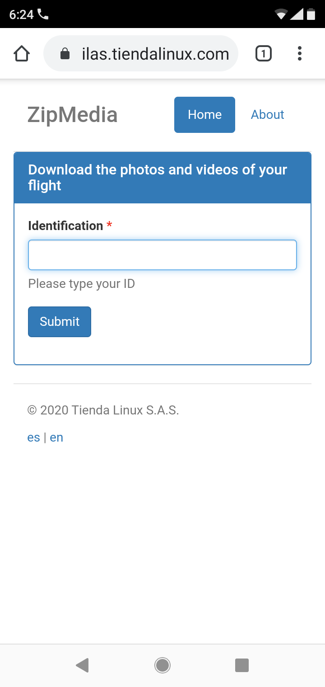
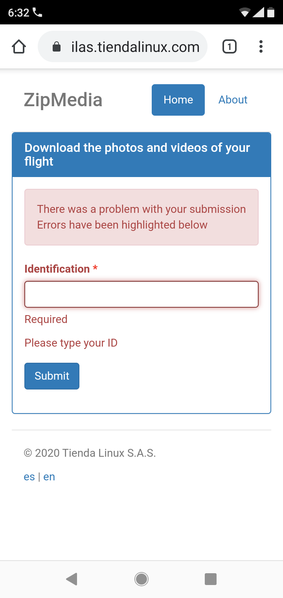
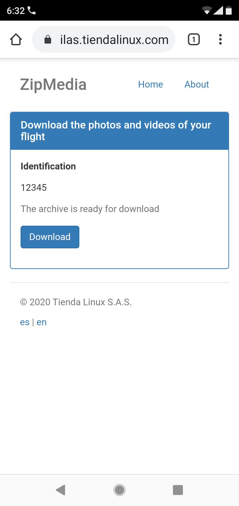
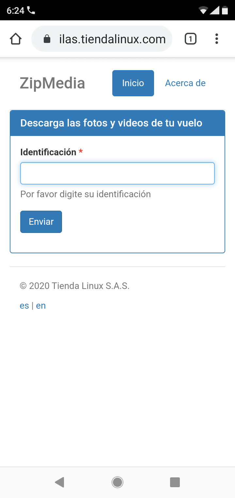

# ZipMedia

A web app to publish and compress directories on the fly to be downloaded as zip files.

This is a simple pyramid app that allows you to serve directories compressed as zip files.

The zip file can be created on memory or served by an already created .zip file, see `production.ini`.

The app is localized in english and spanish

You can add your own localizations using GNU gettext (.mo files) see `i18n.txt` and `i18n.sh`.

The zip files can be served using this app (on the fly or static) or you can delegate the function to your webserver on a specific location.

The app works also behind a web server thourhg https. (Only tested on nginx).

## Performance

The on the fly zip creation don't work on a raspberry pi with limited memory (512Mb) so I decided to add the static zip server and use the 7-zip software that allows people in Windows to create the zip file on the server.

However the zip created with 7-zip don't validate as a valid zip file so I skip this check while using that option.

## History

I wrote this app to learn about pyramid while building a simple app that allows a user to share directories containing photos and videos of 500 MB size in average.

The app is used at the flying sited that I am used to attend, so the pilots can copy the results of their camera from a computer to a network share in a Raspberry Pi Server via Samba and let the customer download the directory of photos and videos via a zip file just by using their id, simple and easy.

## Screenshoots

Search:

Form validation:

Download:

i18n spanish:

## Main tools used:

- Pyramid: https://trypyramid.com/
- Chameleon: https://chameleon.readthedocs.io/en/latest/
- ZipStream: https://pypi.org/project/zipstream/
- Bootstrap: https://getbootstrap.com/docs/3.3/
- Deform: https://docs.pylonsproject.org/projects/deform/en/latest/

## TODO

Test the new zipstream-new https://pypi.org/project/zipstream-new/
